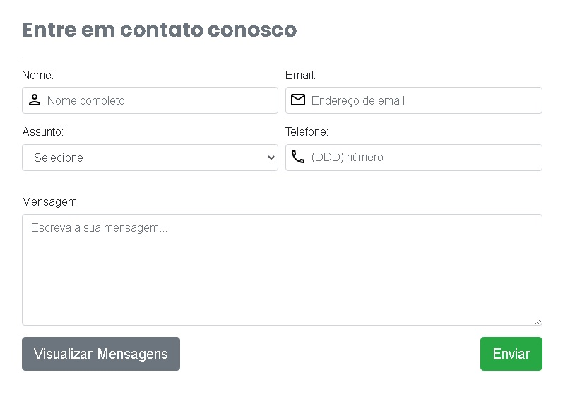

<h1 align="center">
  Formulário de Contato
</h1>
</h1>

  <a href="#-tecnologias">Tecnologias</a>&nbsp;&nbsp;&nbsp;|&nbsp;&nbsp;&nbsp;
  <a href="#-projeto">Projeto</a>&nbsp;&nbsp;&nbsp;|&nbsp;&nbsp;&nbsp;
  <a href="#memo-licença">Licença</a>&nbsp;&nbsp;&nbsp;|&nbsp;&nbsp;&nbsp;

 

  

## 🚀 Tecnologias

Esse projeto foi desenvolvido com as seguintes tecnologias:

-   HTML
-   CSS
-   PHP
-   JavaScript
-   MySQL

Utilitários

-   [Bootstrap](https://getbootstrap.com/)
-   [Google font- Material icons](https://fonts.google.com/icons?selected=Material+Icons+Outlined&icon.query=phone)
-   [jQuery](https://igorescobar.github.io/jQuery-Mask-Plugin/)
-   [XAMPP](https://www.apachefriends.org/pt_br/index.html)

## 💻 Projeto

Formulário de contato com CRUD utilizando HTML, CSS, Bootstrap, PHP, Javascript e conexão ao banco de dados MySQL.

## 📝 Licença

Esse projeto está sob a licença MIT.
